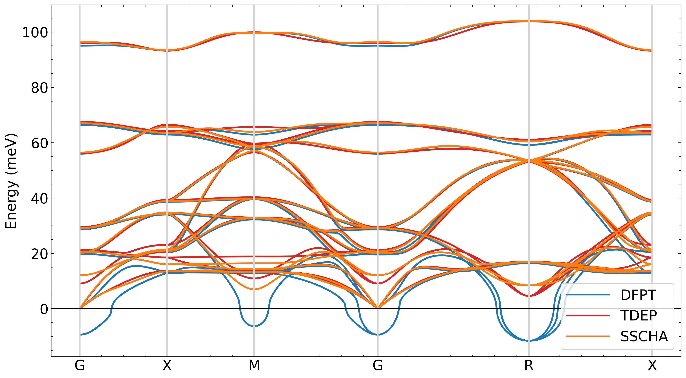

## Title: Hands-on — PERTURBO Interface with TDEP and SSCHA
### Last updated: Sep 9, 2025


This hands-on shows how to build `epr.h5` with second-order force constants imported from TDEP or SSCHA and then compute phonon dispersions in PERTURBO. We use SrTiO3 without SOC (prefix `sto-nosoc`). Although the force constants come from TDEP/SSCHA, DFPT data are still required for perturbation potentials (dvscf), non-analytic corrections, and metadata.

For background and keyword reference, see the online tutorial: https://perturbo-code.github.io/mydoc_tdep.html


## Objectives
- Import 2nd-order force constants from TDEP or SSCHA into `epr.h5` via `qe2pert.x`.
- Reuse DFPT dvscf and Wannier data prepared from pw.x/ph.x and Wannier90.
- Validate by computing and comparing phonon dispersions with PERTURBO.


## Dataset and Layout
All needed inputs are included under this example folder: https://caltech.app.box.com/s/va0568719rn0y28j1s2mfk09ihw3buuj/folder/297934532802

- `pw-ph-wann/`
  - `nscf/`: QE nscf used for Wannierization
  - `wann/`: Wannier90 results (`*_u.mat`, `*_centres.xyz`, `.win`)
  - `phonon/`: DFPT results (`dyn*.xml`, `dvscf_q*`, `phsave`, `dyn0`)
- `tdep/`: TDEP workflow helpers, supercell configs, and notes
- `sscha/`: SSCHA workflow helpers and example dynamical matrices `dyn_pop3_*.xml`
- `qe2pert-tdep/`: Input and TDEP files for `qe2pert.x`
- `qe2pert-sscha/`: Input for `qe2pert.x` with SSCHA-provided phonons
- `perturbo/pert-phdisp/`: PERTURBO input to plot dispersions


## Prerequisites
- QE, ph.x, Wannier90 results prepared (already provided here under `pw-ph-wann/`).
- PERTURBO built with HDF5. `qe2pert.x` available in your PATH.
- For plotting, optional: `perturbopy` Python package.

Tip: You can run inside the official PERTURBO Docker image if preferred.


## Step 0 — Quick sanity check (provided data)
Download the data and open docker in the corresponding folder. 
```
docker run --rm -it -v /Users/yao/Desktop/worksop-2025:/workspace -w /workspace perturbo/perturbo:gcc_mpi_3.0 bash
```
`/Users/yao/Desktop/worksop-2025` = your downloading folder. 

- NSCF and Wannier data are provided under:
  - `example07-sto-tdep-sscha/pw-ph-wann/nscf`
  - `example07-sto-tdep-sscha/pw-ph-wann/wann`
- DFPT phonon data and dvscf live in:
  - `example07-sto-tdep-sscha/pw-ph-wann/phonon/save`

No need to re-run QE/DFPT/Wannier for this hands-on; we will reuse these.


## Step 1 — Build epr.h5 using DFPT phonons (baseline)
This constructs the harmonic baseline `epr.h5` from DFPT (`dyn*.xml`, `dvscf_q*`, `phsave`) and Wannier data.

1) Inspect qe2pert input

```text
example07-sto-tdep-sscha/qe2pert-dfpt/qe2pert.in:1
&qe2pert
  prefix       = 'sto-nosoc'
  outdir       = './tmp'
  phdir        = '../pw-ph-wann/phonon/save'
  nk1 = 4; nk2 = 4; nk3 = 4
  num_wann     = 3
  dft_band_min = 21
  dft_band_max = 23
  lwannier     = .true.
/
```

2) Run qe2pert.x

```bash
cd example07-sto-tdep-sscha
mkdir qe2pert-dfpt
cd qe2pert-dfpt

# link nscf 
mkdir tmp 
cd tmp 
ln -sf ../../pw-ph-wann/nscf/tmp/sto-nosoc.xml
ln -sf ../../pw-ph-wann/nscf/tmp/sto-nosoc.save/

# link Wannier matrices/centers if not already present
ln -sf ../pw-ph-wann/wann/sto-nosoc_u.mat
ln -sf ../pw-ph-wann/wann/sto-nosoc_centres.xyz

qe2pert.x -i qe2pert.in > qe2pert.out
```

3) Check outputs
- `sto-nosoc_epr.h5` and `qe2pert_output.yml`
- This will be your DFPT reference for comparison with TDEP/SSCHA.


## Step 2 — Build epr.h5 using TDEP force constants
We read force constants from TDEP’s `infile.forceconstant` and lattice from `infile.ucposcar`, while keeping dvscf and non-analytic data from DFPT.

1) Inspect inputs and template
   - TDEP files are placed in `example07-sto-tdep-sscha/qe2pert-tdep/`:
     - `infile.forceconstant`
     - `infile.ucposcar`
   - DFPT dvscf and `phsave` are taken from `../pw-ph-wann/phonon/save`.
   - Edit `example07-sto-tdep-sscha/qe2pert-tdep/qe2pert.in` and ensure these key lines:

```text
example07-sto-tdep-sscha/qe2pert-tdep/qe2pert.in:1
&qe2pert
  prefix     = 'sto-nosoc'
  outdir     = './tmp'
  phdir      = '../pw-ph-wann/phonon/save'
  nk1 = 4; nk2 = 4; nk3 = 4
  num_wann   = 3
  dft_band_min = 21
  dft_band_max = 23
  lwannier   = .true.
  tdep       = .true.     ! read TDEP force constants + polar correction info if present
  symmborn   = .true.     ! use DFPT Born + dielectric from phdir unless overridden
/
```

Notes:
- Set `tdep = .true.` to activate reading `infile.forceconstant` and `infile.ucposcar` in the working directory.
- Keep `phdir` pointing to DFPT phonon folder to reuse dvscf and non-analytic corrections.

2) Run qe2pert.x

```bash
cd example07-sto-tdep-sscha/qe2pert-tdep

# link nscf 
mkdir tmp 
cd tmp 
ln -sf ../../pw-ph-wann/nscf/tmp/sto-nosoc.xml
ln -sf ../../pw-ph-wann/nscf/tmp/sto-nosoc.save/

# link Wannier matrices/centers if not already present
ln -sf ../pw-ph-wann/wann/sto-nosoc_u.mat
ln -sf ../pw-ph-wann/wann/sto-nosoc_centres.xyz

# build epr.h5 from TDEP + DFPT + Wannier
qe2pert.x -i qe2pert.in | tee qe2pert.out
```

3) Check outputs
- `sto-nosoc_epr.h5` (or `sto-tdep_epr.h5` if you set a different prefix)
- `qe2pert_output.yml` summary
- Look for a normal termination line in `qe2pert.out`.


## Step 3 — Build epr.h5 using SSCHA force constants
We use SSCHA dynamical matrices (`dyn_pop3_*.xml`) and reassemble a QE-like `phonon/save/` directory that mixes SSCHA dyn with DFPT dvscf.

1) Create a phonon/save folder populated with links
   - SSCHA provides `dyn_pop3_*.xml` in `example07-sto-tdep-sscha/sscha/`.
   - Use the helper script to build a `phonon/save/` with matching `dyn*.xml`, `dvscf_q*`, `dyn0`, and `phsave` links:

```bash
cd example07-sto-tdep-sscha/sscha
chmod +x 5-new-phonon-folder.sh
./5-new-phonon-folder.sh 
# When prompted, enter the number of phonon files (10)

# This creates: sscha/phonon/save with sto-nosoc.dyn*.xml, dvscf_q*, and phsave symlinked.
```

2) Prepare qe2pert input

```text
example07-sto-tdep-sscha/qe2pert-sscha/qe2pert.in:1
&qe2pert
  prefix     = 'sto-nosoc'
  outdir     = './tmp'
  phdir      = '../sscha/phonon/save'   ! the folder created in step 2.1
  nk1 = 4; nk2 = 4; nk3 = 4
  num_wann   = 3
  dft_band_min = 21
  dft_band_max = 23
  lwannier   = .true.
/
```

3) Run qe2pert.x

```bash
cd example07-sto-tdep-sscha/qe2pert-sscha

# link nscf 
mkdir tmp 
cd tmp 
ln -sf ../../pw-ph-wann/nscf/tmp/sto-nosoc.xml
ln -sf ../../pw-ph-wann/nscf/tmp/sto-nosoc.save/

# link Wannier matrices/centers if not already present
ln -sf ../pw-ph-wann/wann/sto-nosoc_u.mat
ln -sf ../pw-ph-wann/wann/sto-nosoc_centres.xyz

qe2pert.x -i qe2pert.in | tee qe2pert.out
```

4) Check outputs
- `sto-nosoc_epr.h5` created in this folder
- `qe2pert_output.yml` summary


## Step 4 — Validate via PERTURBO phonon dispersion
Use the generated `epr.h5` to plot dispersions and compare TDEP/SSCHA/DFPT.

1) Phonon dispersion input

```text
example07-sto-tdep-sscha/perturbo/pert-phdisp/pert.in
&perturbo
  prefix    = 'sto-nosoc'
  calc_mode = 'phdisp'
  fqlist    = 'sto_phdisp.qpt'
/
```

2) Run for each epr.h5 you want to test

```bash
cd example07-sto-tdep-sscha/perturbo/pert-phdisp

# Option A: DFPT baseline
ln -sf ../../qe2pert-dfpt/sto-nosoc_epr.h5 
perturbo.x -i pert.in | tee pert.out
cp sto-nosoc_phdisp.yml sto-dfpt_phdisp.yml

# Option B: TDEP-based
ln -sf ../../qe2pert-tdep/sto-nosoc_epr.h5
perturbo.x -i pert.in | tee pert_tdep.out
cp sto-nosoc_phdisp.yml sto-tdep_phdisp.yml

# Option C: SSCHA-based
ln -sf ../../qe2pert-sscha/sto-nosoc_epr.h5
perturbo.x -i pert.in | tee pert_sscha.out
cp sto-nosoc_phdisp.yml sto-sscha_phdisp.yml

```

3) Outputs
- `sto_phdisp.yml`, `sto.phdisp` (filenames follow `prefix` and input)
- Comparison script: `/workspace/example07-sto-tdep-sscha/perturbo/pert-phdisp/compare-phonon.py`

```text
/workspace/example07-sto-tdep-sscha/perturbo/pert-phdisp/compare-phonon.py:1
import perturbopy.postproc as ppy
import matplotlib.pyplot as plt
from matplotlib.lines import Line2D

# Configure plotting style once
plt.rcParams.update(ppy.plot_tools.plotparams)

# Create a figure and axis for plotting
fig, ax = plt.subplots()

ph_files = ['sto-dfpt_phdisp.yml', 'sto-tdep_phdisp.yml', 'sto-sscha_phdisp.yml']
colors   = ['tab:blue', 'tab:red', 'tab:green']
labels   = ['DFPT', 'TDEP', 'SSCHA']

# Labels for a simple-cubic path G–X–M–G–R–X used in sto_phdisp.qpt
points = {
    'G': [0.0, 0.0, 0.0],
    'X': [0.0, 0.5, 0.0],
    'M': [0.5, 0.5, 0.0],
    'R': [0.5, 0.5, 0.5],
}

for i, f in enumerate(ph_files):
    phdisp = ppy.Phdisp.from_yaml(f)
    phdisp.qpt.add_labels(points)
    phdisp.plot_phdisp(ax, c=colors[i])

# Reference line at 0
plt.axhline(0, lw=1, c='k')

# Legend via proxy lines
proxies = [Line2D([0], [0], color=colors[i], lw=2) for i in range(len(colors))]
plt.legend(proxies, labels, loc='best')

# Save comparison plot
plt.savefig('compare-phdisp.png', dpi=300, bbox_inches='tight')
```

- Generate the comparison plot:

```bash
cd example07-sto-tdep-sscha/perturbo/pert-phdisp
python3 compare-phonon.py
```

- The image is saved as `compare-phdisp.png`:




## Common Checks and Tips
- Ensure `prefix` is consistent across QE, Wannier, qe2pert, and PERTURBO inputs.
- `phdir` should contain: `dyn0`, `dyn*.xml` (SSCHA or DFPT), dvscf files `*_dvscf_q*`, and `phsave/`.
- For TDEP:
  - Put `infile.forceconstant` and `infile.ucposcar` in the qe2pert working folder and set `tdep = .true.`.
  - If you have `infile.lotosplitting`, qe2pert can take non-analytic info from there; otherwise leave `symmborn = .true.` to reuse DFPT Born/dielectric.
- For SSCHA:
  - The helper `5-new-phonon-folder.sh` links SSCHA `dyn_pop3_*.xml` to QE-like `dyn*.xml` and reuses DFPT dvscf.
  - Make sure the number you enter matches the number of `dyn_pop3_*.xml`/q-points.
- Review `qe2pert_output.yml` after each run for a compact summary.


## Troubleshooting
- qe2pert complains about missing dvscf: check `phdir` points to a folder that contains `*_dvscf_q*` and `phsave/`.
- Wrong number of modes/q-points: verify the `dyn*.xml` count matches the grid used for dvscf.
- Units/structure mismatch in TDEP: confirm `infile.ucposcar` matches the DFT cell used for Wannier/DFPT.
- Dispersion looks non-analytic at Gamma: ensure non-analytic corrections are present (Born charges + dielectric from DFPT or TDEP lotosplitting).


## Where to go next
- Compute electron-phonon matrix elements and transport starting from the new `epr.h5`.
- Swap different `epr.h5` (DFPT, TDEP, SSCHA) to study temperature-renormalized vs harmonic dispersions.

Reference tutorial: https://perturbo-code.github.io/mydoc_tdep.html
