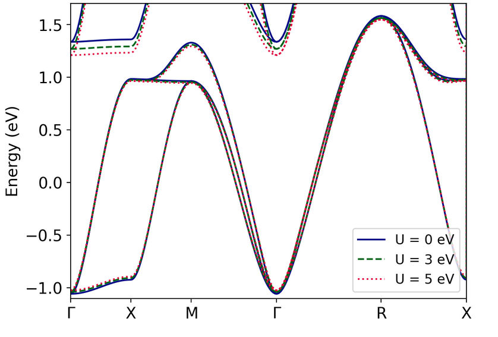
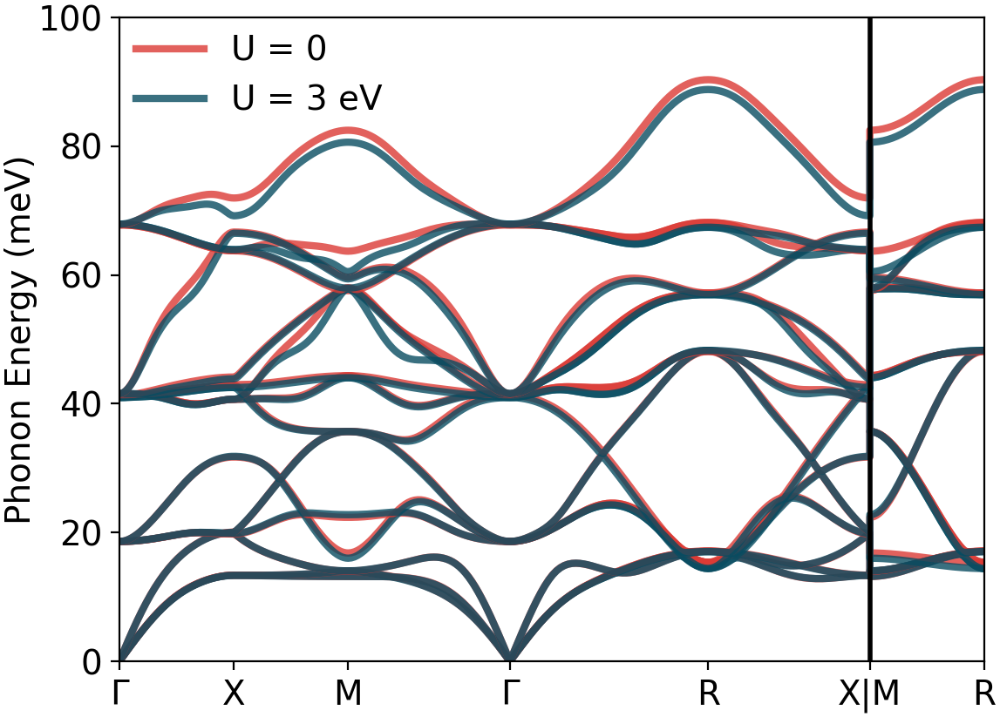
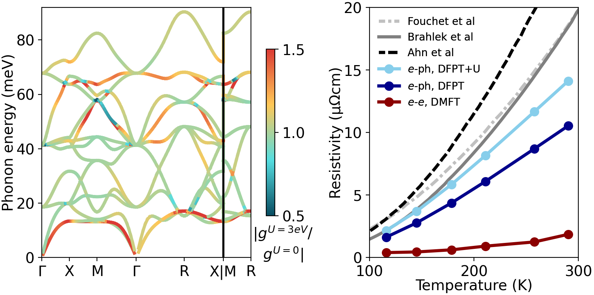

<div markdown="span" class="alert alert-warning" role="alert"><i class="fa fa-folder fa"></i>
<b> Directory:</b>
<i>
example12-svo-dft+u/
</i>
&nbsp;&nbsp;
<span style="float: right;">
<a href=
"https://caltech.box.com/s/usbfv9r54akue21rig7bikkkvx8kwhwc"
target="_blank">link</a>
</span>
</div>

## Quantum Espesso and qe2pert Calculations with DFT+U

Before running the DFPT+U phonon calculations with Quantum Espresso, it is necessary to modify the file `PHonon/PH/dnsq_bare.f90` by adding the following lines below the line reading `CALL sym_dns_wrapper (ldim, dnsbare, dnsbare_all_modes)` and recompile Quantum Espresso. 

```fortran 
  !added to output symmetrized dnsbare in the pattern basis
  if(ionode) then
     CALL seqopn (iundnsbare, 'dnsbare_pattern', 'formatted', exst)
     WRITE(iundnsbare,*) dnsbare_all_modes
     CLOSE (unit=iundnsbare,status='keep')
  endif
```

Run the scf, nscf, phonon, and Wannier calculations as normal, specifying Hubbard parameters in the scf and nscf files. Note that `ph.x` is not compatible with all Hubbard options available in `pw.x`. For the phonon calculations, it is necessary to copy to following output files for each q point into the save folder `prefix.dnsbare_pattern_q*`, `prefix.dnsbare_q*`, `prefix.dnsscf_q*`, `prefix.dnsorth_cart_q*`, `prefix.dvscf_q*`, and `prefix.dyn*.xml`. 

Then run `qe2pert.x` as normal. You will notice the following lines in the `qe2pert.out` file. 

```fortran
     QE2PERT
     ---------------------------
     DFPT + U calculation
```

## Electronic Structure of SrVO3

The addition of a static Hubbard interaction does not change the $t_{2g}$ bands in SVO. 
(If beyond-DFT methods are used, the spectra are significantly renormalized.) 



On the other hand, the phonon dispersion are slightly modified. The smaller effect of 
DFT+U on phonon energies may be because there is only 1 electron in the $d$ orbitals, 
so it has a smaller effect on energy. 



However, the response of these bands to phonons is modified because DFT+U results 
in a modified electronic response to perturbations which would split orbitals or 
disproportionate charge on different sites. This is primarily because DFT+U corrects 
the self-interaction error in DFT calculations. 


It is important to recognize the strengths and limitations of static methods such as DFT+U. 
While DFT+U can do a good job correcting the self-interaction errors in DFT, it cannot capture
intrinsically dynamical effects such as the renormalized quasi-particle dispersion found in SVO. 
In some cases, DFT+U can treat Mott insulating states, such as those accompanied by other forms 
of symmetry breaking such as antiferromagnetism. However, DFT+U generally cannot treat the 
paramagnetic Mott insulating phase. 

## Calculations on SrVO3. 

The calculations below look at the e-ph coupling and conductivity in the correlated metal SrVO3 and the effect of using DFT+U. For more information, see
<a href="https://doi.org/10.1103/PhysRevLett.133.186501" target="_blank"> <i>Phys. Rev. Let. 133, 186501 (2024)</i> </a>

-  Run the Quantum Espresso scf, nscf, and phonon calculations, the wannier90 calculations, and `qe2pert.x` using the files provided and following the instructions above. 

-  Run the Perturbo calculations in `pert-bands`, `pert-phdisp`, and `pert-ephmat` and plot the results (e.g. with Perturbopy). You will find a 3-band electronic structure characteristic of t-2g orbitals with a band width of ~2.5 eV, and phonons with a number of optical modes with strong e-ph coupling and energies of 50-90 meV. 

-  Then run the Perturbo calculations in `pert-setup`, `pert-imsigma`, and `pert-trans-RTA`.  

Hint: you can run all calculations with a job script like: 
```bash
PT="$PATH_TO_QE/qe-***/perturbo/bin/perturbo.x"
RUN="srun -n $mpi_tot $PT -npools $mpi_tot"

cd pert-bands
$RUN -i pert.in > pert.out
cd ../pert-phdisp
$RUN -i pert.in > pert.out
cd ../pert-ephmat
$RUN -i pert.in > pert.out
cd ../pert-setup
$RUN -i pert.in > pert.out
cd ../pert-imsigma
cp ../pert-setup/svo_tet.* ./
$RUN -i pert.in > pert.out
cd ../pert-trans-RTA
cp ../pert-imsigma/svo.imsigma ./
cp ../pert-setup/svo_tet.* ./
$RUN -i pert.in > pert.out
```
-  Check the outputs of in `pert-trans-RTA`. In the `svo.trans_coef` output file, you should get values of the conductivity (1/Ohm/m) of approximately 

```
#  T (K)   E_f(eV)   n_c (cm^-3)      sigma_xx       sigma_xy       sigma_yy       sigma_xz       sigma_yz       sigma_zz
  100.00  12.48930   0.51237E+22    0.537733E+08  -0.107585E+07   0.537733E+08  -0.107585E+07  -0.107585E+07   0.537733E+08
  200.00  12.48930   0.51336E+22    0.141496E+08  -0.837104E+05   0.141496E+08  -0.837104E+05  -0.837104E+05   0.141496E+08
  300.00  12.48930   0.51501E+22    0.733779E+07  -0.146515E+05   0.733779E+07  -0.146515E+05  -0.146515E+05   0.733779E+07
```

 Note: These Perturbo calculations are meant to run in ~10 minutes and provide approximate results. To increase the accuracy, consider using larger coarse k / q grids, a larger k-grid in transport, a smaller delta_smear parameter, and more sampled q-points in the imsigma calculation.

-  Consider running the calculations with different values of the Hubbard U parameter between 0 and 3 eV. You will notice that 
the Hubbard parameter has essentially no effect on the bands and a minor effect of phonon dispersion, but that the e-ph coupling
of some phonon modes and the resistivity significantly increase with increasing U. The value U = 2 eV used in this tutorial is 
probably too low, but improves the convergence of the Quantum Espresso phonon calculations. 

## Comparison of Transport and Electron-Phonon Coupling With and Without Hubbard U

Below, we show transport calculations performed with Perturbo with greater k / q grids for convergence 
and comparisons with e-e scattering rates computed with DMFT and experimental resistivity. 
The addition of the Hubbard U parameter increases the electron-phonon coupling for 
several optical phonon branches as well as TA phonons. This results in a roughly ~30% increase
in resistivity. 




